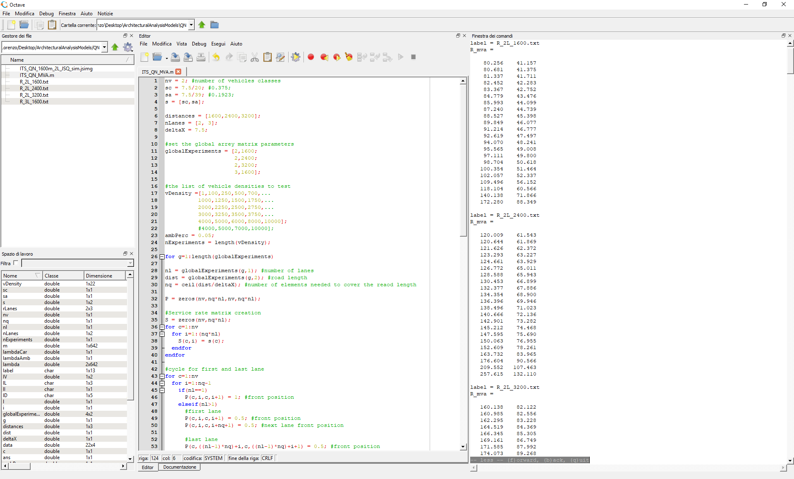
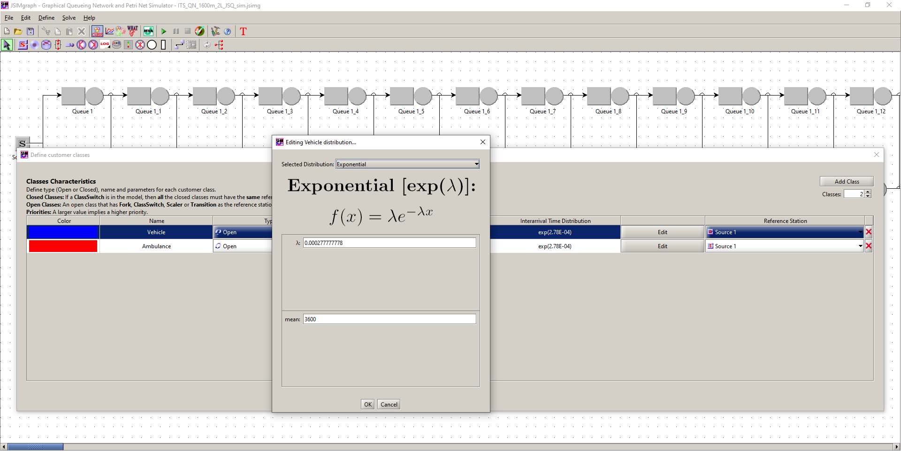
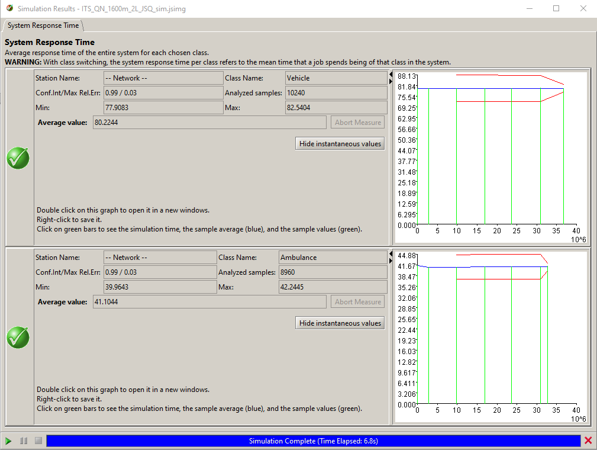
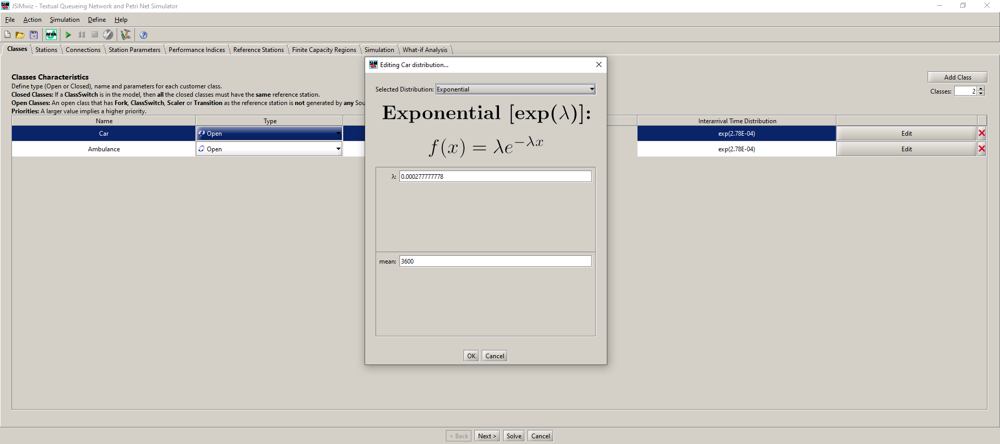
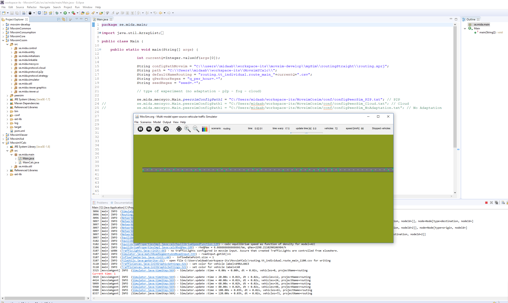

# Continuous Model-based Engineering of QoS-Aware Self-adaptive Systems
This page contains the architectural and simulation models to replicate the results of the paper: Continuous Model-based Engineering of QoS-Aware Self-adaptive Systems.

# Architectural Models
At the following [link](https://lnu.app.box.com/s/3iofyvxec5qpabg12yyk94bicz6fjzey) it is possible to download the architectural models. The analysis we did are two:
- A MVA analysis, that is a pure analytical evaluation of the system
- A simulation of the same architectural models enhanced with state depandant features

### MVA Analysis
In order to replicate the mathematical analysis we did, follow the following steps:

1. Download and install the [GNU Octave tool](https://www.gnu.org/software/octave/)
2. Install the package developed by Moreno Marzolla called *queueing*. This package allows to model and analyse Queueing Network systems. For further details about this package, read the package manual. You can install the package from the tool directly or download the package and install it locally
   1. `octave:1>pkg install -forge queueing` for installing it from the tool (network connection is required)
   2. `octave:1>pkg install queueing-1.2.6.tar.gz` for installing the package if you download it manually
3. Open the tool and write this command in the command line to load the package into the tool `octave:1>pkg load queueing `.
4. Open the MVA model you downloaded. Navigate into the sources folder you downloaded and open the file `\ArchitecturalAnalysisModels\QN\ITS_QN_MVA.m`
5. Run the analysis
6. The results are visualized on the right side of the tool. The script saves the results for each analysis into a .txt file that you can find in the same directory of the model. The name of the txt files reflect the experiment configuration. The results are the system response time for each vehicle type, grouped by experiment

  

### Simulation of the enhanced models
In order to replicate the simulation of the enhanced models of the Queueing Network and Petri Net models follow the following steps.

First we did the analysis of the **Queueing Network** models that where enanched with a Join Shortest Queue routing policy.

1. Download and install the [JMT tool](http://jmt.sourceforge.net/)
2. Run the tool and select `Graphical` to open the graphical editor. Then, through the tool navigate to the folder where you downloaded the source files and open the file `\ArchitecturalAnalysisModels\QN\ITS_QN_1600m_2L_JSQ_sim.jsimg`
3. Set up the traffic flow you desire through the tool settings. Click on  to setup the arrival rates of the different job classes. Edit each class and instert either the *lambda* or the *mean* of the *Interarrival Time Distribution*. You can find all the traffic flow lambda we used in the `TrafficFlow_Lambdas_ArrivalRate.txt` file available in the source folder you downloaded. In this file you can find the lambdas relative to the cars and ambulances with respect to vechicle/hour flows. Copy the traffic flow lambdas you want to execute in the tool

  

4. After the simulation is set up, run it. The results collected are the system response times for each vehice type. The results are plotted while data are collected. The tool collects all the data and computes the minimum, maximum and average value for each performance measure you select, as shown in the following screenshot. We used always the average ones

  

Second we did the analysis of the **Petri Net** where the movement and overtake logic implement a secury rule.

1. Download and install the [JMT tool](http://jmt.sourceforge.net/).
2. Run the tool and select `Textual` to open the textual editor. Due to the size of the model, either in terms of nodes and links, the graphical editor is not powerful enough to let you work without lag. Instead, the textual one handles it. Moreover, through the tool navigate to the folder where you downloaded the source files and open the file `\ArchitecturalAnalysisModels\QN\PN_1600_2L_2LA.xml`. This file implements the two-look-ahead safty rule. For the three-look-ahead safty rule model open `\ArchitecturalAnalysisModels\QN\PN_1600_2L_3LA.xml`.
3. Set up the traffic flow you desire through the *Classes* tab. Here you can setup the arrival rates of the different job classes. Edit each class and instert either the *lambda* or the *mean* of the *Interarrival Time Distribution*. You can find all the traffic flow lambda we used in the `TrafficFlow_Lambdas_ArrivalRate.txt` file available in the source folder you downloaded. In this file you can find the lambdas relative to the cars and ambulances with respect to vechicle/hour flows. Copy the traffic flow lambdas you want to execute in the tool

  

4. After the simulation is set up, run it. The results collected are the system response times for each vehice type. The results are plotted while data are collected. The tool collects all the data and computes the minimum, maximum and average value for each performance measure you select, as shown in the following screenshot. We used always the average ones

  

# Simulation Models
At the following [link](https://lnu.app.box.com/s/3iofyvxec5qpabg12yyk94bicz6fjzey) it is possible to download the simulation models. You need Eclipse to execute the models. To run the co-simulation follow the following steps:

1. Download the folder containing the ITS workspace and import the projects in the workspace as Eclipse Moven projects
2. The main file to run the experiments is: *se.mida.main.Main* in the project *MovsimYCalc*
3. In the program arguments you should indicate the number of vehicles per hour you want to experiment with (e.g., 1100)
4. The *conf* folder in *MovsimCosim* contains all the different configurations for the experimented scenarios. In the main file you must point to the configuration file location you want to experiment with
5. All the results are presented after the end of the simulation

  

